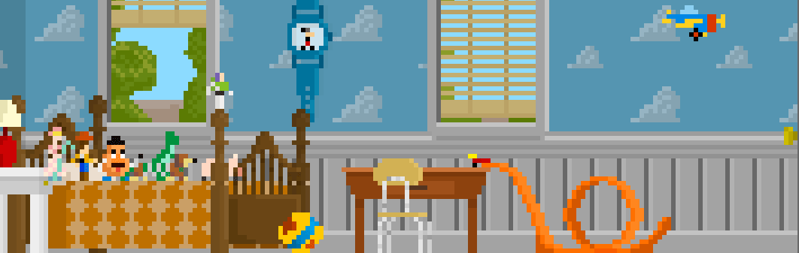

</img>

  
  
  
  
  
 
    
  
  
  
  

### Hi there 👋

Currently working on keeping my pieces from falling off
- 🌱 I’m currently learning new wisecracking comments
- 👯 I’m looking to collaborate on finding a new hat piece
- 🤔 I’m looking for help with finding my left ear 
- 📫 How to reach me: Send a letter to Andy's house
- ⚡ Fun fact: I ran for mayor in 1985

### My public repos 🧑‍💻

### My stats 🚀

